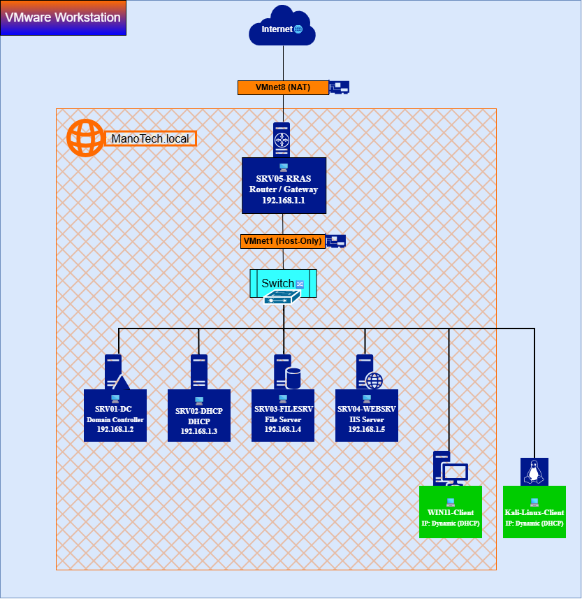

# Network Design

## Overview

This document describes the network topology, IP addressing scheme, and communication between the devices and services in the ManoTech Enterprise Windows Server Lab.

The lab is built using VMware Workstation and uses a private virtual network to simulate a small enterprise environment.

---

## Network Topology

The lab is built using an isolated VMware virtual network where all servers and clients communicate through the internal network.

The following diagram illustrates the network topology of the ManoTech Enterprise Windows Server Lab.

**Network Topology Diagram**



The diagram represents:

* RRAS01 as the network gateway
* DC01 providing AD DS, DNS, AD CS, and WSUS
* DHCP01 providing DHCP services
* FILE01 providing file services
* WEB01 hosting IIS
* Windows 11 domain client
* Kali Linux integration/testing client
* Internal network `192.168.1.0/24`

---

## Network Information

| Setting         | Value            |
| --------------- | ---------------- |
| Network Address | `192.168.1.0/24` |
| Subnet Mask     | `255.255.255.0`  |
| Default Gateway | `192.168.1.1`    |
| DNS Server      | `192.168.1.2`    |
| Domain Name     | `manotech.local` |

---

## Server IP Address Plan

| Server            | Hostname |  IP Address | Role                               |
| ----------------- | -------- | ----------: | ---------------------------------- |
| Domain Controller | DC01     | 192.168.1.2 | Active Directory, DNS, AD CS, WSUS |
| DHCP Server       | DHCP01   | 192.168.1.3 | DHCP                               |
| File Server       | FILE01   | 192.168.1.4 | File Services                      |
| Web Server        | WEB01    | 192.168.1.5 | IIS Web Server                     |
| Router            | RRAS01   | 192.168.1.1 | Gateway, Routing, NAT              |

Infrastructure servers use static IP addresses.

---

## Additional Services

The following enterprise services are implemented within the lab:

| Service                                       | Host  | Description                                       |
| --------------------------------------------- | ----- | ------------------------------------------------- |
| Active Directory Certificate Services (AD CS) | DC01  | Internal Enterprise PKI / Certificate Authority   |
| Windows Server Update Services (WSUS)         | DC01  | Centralized Windows Update Management             |
| IIS                                           | WEB01 | Internal company website                          |
| Group Policy                                  | DC01  | Centralized configuration and security management |

AD CS and WSUS are hosted on **DC01** and are not deployed as separate virtual machines.

---

## Client Configuration

Domain-joined Windows clients receive their network configuration automatically from the DHCP Server.

Assigned network settings include:

* IP Address
* Subnet Mask
* Default Gateway
* DNS Server
* DNS Domain Information

Additional domain configuration is provided through Group Policy, including:

* WSUS Configuration
* Security Policies
* Drive Mapping
* Software Deployment
* Certificate Auto-Enrollment where applicable

---

## Network Communication

The main communication paths within the environment are:

```text
Windows 11 Client
        │
        ├── DNS ───────────────► DC01
        │
        ├── Authentication ───► DC01
        │
        ├── Group Policy ─────► DC01
        │
        ├── File Access ──────► FILE01
        │
        ├── Web Access ───────► WEB01
        │
        └── Windows Updates ──► WSUS on DC01
```

External network communication follows:

```text
Client
   │
   ▼
RRAS01
192.168.1.1
   │
   ▼
External Network
```

RRAS01 provides routing and NAT for the internal network.

---

## Network Goals

The network is designed to provide:

* Centralized authentication
* Automatic IP address assignment
* Internal DNS name resolution
* Secure file sharing
* Internal web hosting
* Centralized Active Directory management
* Centralized Windows Update management
* Enterprise Public Key Infrastructure (PKI)
* Certificate management
* Controlled network access
* Centralized security configuration

---

## Validation

The network infrastructure is validated using connectivity, DNS, domain, and service-level tests.

### Connectivity Tests

```text
ping 192.168.1.2
ping 192.168.1.3
ping 192.168.1.4
ping 192.168.1.5
```

### DNS Tests

```text
nslookup manotech.local
nslookup www.manotech.local
```

### Network Configuration

```text
ipconfig /all
```

### Domain Validation

```text
whoami
gpresult /r
```

The validation process verifies:

* Server-to-server connectivity
* DHCP address assignment
* DNS name resolution
* Active Directory connectivity
* Group Policy application
* Internal web access
* File server access
* WSUS client communication
* Certificate enrollment

Detailed validation results are documented in the **Testing and Validation** section.

---

## Future Expansion

Potential future improvements to the network include:

* VPN Remote Access
* Backup and Recovery Solution
* Windows Deployment Services (WDS)
* Microsoft Deployment Toolkit (MDT)
* PowerShell Automation
* Advanced Security Hardening
* VLAN Segmentation
* Additional Windows Clients
* Advanced Linux/Windows Integration

Monitoring infrastructure such as Zabbix is **not part of the current project architecture**.

---

## Revision History

| Version | Date       | Author        | Description                                                                              |
| ------- | ---------- | ------------- | ---------------------------------------------------------------------------------------- |
| 1.0     | 2026-07-26 | Mohamed Osama | Initial documentation                                                                    |
| 1.1     | 2026-08-04 | Mohamed Osama | Reviewed and updated documentation                                                       |
| 1.2     | 2026-08-09 | Mohamed Osama | Updated network design, server naming, infrastructure services, and current architecture |
